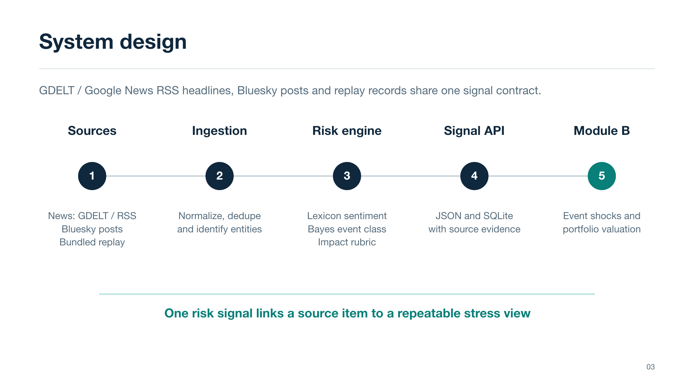

# SignalScope - S&P Global & Crisil Campus Hackathon

**Candidate Name:** Krish Agrawal  
**College Email ID:** f20230956@pilani.bits-pilani.ac.in  
**College / Campus:** BITS Pilani, Pilani Campus  
**Public Repository:** TODO — publish this repository as `bits-pilani-krish-agrawal-hackathon` and insert its public URL.  
**Demo Video Link:** TODO — upload the recorded walkthrough to YouTube as *Unlisted*, insert its URL, and verify it opens in a private browser window.  
**Slide Deck:** [Presentation PDF](docs/presentation.pdf)

## 1. Project Overview / Problem Statement & Approach

Financial risk teams must interpret fast-moving, unstructured reports before they can decide which exposures deserve attention. SignalScope ingests two public text streams—news headlines from GDELT, with a Google News RSS fallback, and public Bluesky posts—and converts each relevant item into a structured signal containing a sentiment score, event classification, impact score, entity, timestamp, and source evidence. A local replay path keeps the demonstration usable when a live feed is unavailable or has no relevant items.

The downstream application is **Module B: strategic portfolio stress testing**. A high-impact signal can trigger an event-specific adverse scenario on a fully synthetic portfolio of loans, bonds, and derivatives. An adverse Credit Event naming a held obligor adds a sector spread shock; an affirmed payment failure or insolvency with negative sentiment also adds an issuer haircut. The dashboard connects the text that produced the signal to a before-and-after valuation and position-level changes. These are transparent scenarios for triage, not forecasts of market prices or realized losses.

## 2. Architecture & Tech Stack



The backend uses **Python 3.9+ and the standard library**: an HTTP server, JSON processing, and SQLite. Event classification uses an in-repository Multinomial Naive Bayes baseline trained on curated examples plus domain cue boosts. Sentiment uses a finance-oriented lexicon with negation handling. A documented severity rubric generates the ordinal impact score. The stress engine applies scenario shocks to synthetic positions. See [the architecture detail](docs/architecture.md) and [model card](docs/model-card.md) for data contracts and assumptions.

The local API includes `GET /api/health`, `GET /api/state`, `POST /api/analyze`, `POST /api/refresh`, `POST /api/stress`, and `POST /api/demo/reset`. See the Quickstart for the exact launch command.

## 3. Dataset Used

- **News:** [GDELT DOC 2.0 ArticleList](https://blog.gdeltproject.org/gdelt-doc-2-0-api-debuts/) is the primary source of recent public article headlines, links, and metadata. If it fails or has no matching results, the adapter tries [Google News search RSS](https://news.google.com/rss/search?q=%22credit+downgrade%22+OR+%22bank+default%22+OR+%22rate+hike%22+OR+sanctions&hl=en-US&gl=US&ceid=US%3Aen) as a best-effort fallback. Both paths analyze headlines only; neither supplies a complete article body. [GDELT documents API rate limiting](https://blog.gdeltproject.org/ukraine-api-rate-limiting-web-ngrams-3-0/). The Google News RSS URL is a public feed rather than a guaranteed developer API.
- **Social:** Public posts from [Financial Times](https://bsky.app/profile/financialtimes.com) and [Bloomberg](https://bsky.app/profile/bloomberg.com) Bluesky author feeds through the [Bluesky AppView API](https://github.com/bluesky-social/atproto/blob/main/lexicons/app/bsky/feed/getAuthorFeed.json). The adapter retains original posts with a strong finance/risk phrase or at least two distinct relevant terms, including a non-ambiguous anchor. This is a narrow publisher-post stream, not a representative sample of general social opinion; live access may be unavailable during a demo.
- **Replay and portfolio:** [`data/demo_signals.json`](data/demo_signals.json) contains fictional text examples, [`data/training_examples.json`](data/training_examples.json) contains curated classifier phrases, and [`data/portfolio.json`](data/portfolio.json) defines a 12-position wholesale-banking portfolio: five loans, four bonds, and three derivatives. These are demonstration assumptions, not S&P Global, Crisil, or other client records.

**No wholesale transaction file was supplied with the case materials.** The attached resource list points to consumer spending and fraud datasets, which do not represent wholesale loans, bonds, or derivatives. We therefore created fictional sample wholesale positions in `data/` and [documented their assumptions](data/README.md). The portfolio's values, sensitivities, and stress shocks are illustrative; they have not been calibrated to a real institution, market book, or historical loss dataset. Replay text supplies deterministic examples when the live sources fail or return no relevant item. Live and replay items are identified by provenance in the interface.

## 4. Quickstart & Installation

**Runtime:** Python 3.9 or newer. No third-party Python package is required for the backend.

```bash
git clone <PUBLIC_REPOSITORY_URL>
cd bits-pilani-krish-agrawal-hackathon
python3 -m src.server
```

Open [http://127.0.0.1:8000](http://127.0.0.1:8000) in a browser. Set `PORT` to use another port, `HOST` to change the bind address, or `RISK_DB` to choose another SQLite database path. The default database is `data/signalscope.db`, created locally by the application. The service also accepts `--host`, `--port`, and `--db` flags. To verify the API or analyze a fictional headline directly:

```bash
curl http://127.0.0.1:8000/api/health
curl -X POST http://127.0.0.1:8000/api/analyze \
  -H 'Content-Type: application/json' \
  -d '{"source":"news","entity":"Aster Manufacturing","text":"Aster Manufacturing missed a bond interest payment and faces a credit downgrade after lenders warned of a possible default."}'
```

To run the test suite:

```bash
python3 -m unittest discover -s tests -v
```

The dashboard supports a deterministic replay, on-demand live refresh, manual text analysis, and stress testing. Impact scores above 7 automatically run a scenario; any signal can also be stressed manually. Live feeds need internet access; failure of either source is reported independently and does not prevent the replay demonstration. To start with an immediate live fetch and refresh at five-minute intervals, use `SIGNALSCOPE_AUTO_REFRESH_SECONDS=300 python3 -m src.server` (the interval must be at least 60 seconds).

**Live connectivity status (2 October 2026):** A current-code `POST /api/refresh` run against a fresh temporary database with `limit: 6` added **11 real signals**: six Google News RSS headlines and five Bluesky posts after relevance filtering. GDELT timed out during the TLS connection, so the news source reported **Fallback** (`degraded`) with the timeout warning; the social source reported **OK** (`ok`). Public feed availability and item counts vary; recheck **Refresh live feeds** from the presentation machine before the final pitch.

**Verification:** With localhost sockets permitted, `python3 -m unittest discover -s tests -v` reported `Ran 26 tests ... OK`. The default shell sandbox reported `Ran 24 tests ... OK (skipped=1)` because `APITests.setUpClass` could not bind localhost; its two test methods were not counted. The 11-signal refresh exercised live ingestion and source-status reporting through the local API. These point-in-time checks do not establish future feed uptime or predictive accuracy.

## 5. Key Results & Domain Impact

The prototype outputs machine-readable risk signals through a local JSON API and displays their provenance, event labels, sentiment, and impact. It links high-impact events to scenario-based valuations for the synthetic portfolio, including the portfolio value before and after stress and the contribution of each position. The bundled examples and portfolio let a reviewer reproduce the same path from text input to risk signal to scenario output.

A fresh-database integration run and a browser run of the **fictional Aster Manufacturing credit example** produced these deterministic scenario results (USD millions):

| Input | Risk signal | Portfolio before | Portfolio after | Simulated loss |
| --- | --- | ---: | ---: | ---: |
| Seeded replay | Credit Event; sentiment `-0.990`; impact `10/10` | `$797.00m` | `$739.04m` | `$57.96m` (`7.27%`) |
| Dashboard **Credit downgrade** input | Credit Event; sentiment `-0.937`; impact `10/10` | `$797.00m` | `$739.04m` | `$57.96m` (`7.27%`) |

The event-specific scenario applied rates `+20 bp`, broad credit spreads `+55 bp`, Industrials spreads `+140 bp`, an Aster issuer haircut of `25%`, equities `-6%`, and FX `-2%`. Rounded position contributions were loans `-$43.74m`, bonds `-$12.52m`, and derivatives `-$1.70m`. These are **simulated losses on fictional positions**, not observed returns or a calibrated back-test. [The five-minute live demo script](docs/demo-script.md) gives the review sequence.

This approach could help an analyst prioritize new reports, inspect why a text item was flagged, and ask how a defined event shock would affect exposed positions. SignalScope is a hackathon prototype: its scores are heuristic, its training examples are curated, and its synthetic stress book does not establish predictive performance or a deployable risk limit. See the [model card](docs/model-card.md) for limitations.

## Submission links to complete

- Publish a **public** GitHub repository with this code under the required naming convention, then replace `<PUBLIC_REPOSITORY_URL>` and the repository placeholder above.
- Add an **Unlisted YouTube** recording link above and verify it plays without login. The submission guide requests a separate recorded walkthrough; the live demonstration in the problem brief is capped at five minutes.
- Check that [docs/presentation.pdf](docs/presentation.pdf) is present and viewable in the public repository before submitting.
