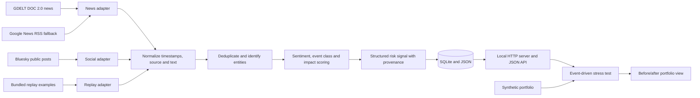

# SignalScope architecture

SignalScope turns incoming public text into traceable risk signals and applies those signals to a synthetic wholesale-banking portfolio. The same normalized record shape is used for live ingestion and bundled replay examples, so the risk engine receives text in one format regardless of its origin. The application runs on Python 3.9 or newer using the standard library HTTP server, with no paid API or hosted model dependency.

## Data flow

1. Each adapter fetches or loads text and records its source, original identifier or URL, and publication time when available.
2. Normalization removes transport-specific formatting and prepares a comparable text record. Deduplication prevents repeat headlines or posts from producing duplicate signals.
3. The risk engine identifies the entity or event discussed, assigns a sentiment score from `-1` to `1`, an event category, and an ordinal impact score from `1` to `10`.
4. The HTTP application exposes structured signals and, when a configured high-impact event arrives, runs a deterministic stress scenario against synthetic holdings.
5. For a severe Credit Event naming an exact held obligor, the stress module adds sector spread stress and an issuer haircut. The dashboard reports the portfolio before and after the scenario alongside the triggering text and scoring evidence.

## Design principles

- **Traceability:** Each signal should retain its source, timestamp, and evidence text so a reviewer can inspect the input behind a score.
- **Repeatability:** Bundled synthetic or public sample records make the end-to-end demonstration reproducible when a live feed has no relevant item or is unavailable.
- **Separation of concerns:** Source adapters, text scoring, and portfolio shocks are independent components. A new data source or scenario can be added without changing the other layers.
- **Honest interpretation:** The impact score ranks the engine's assessed severity. Portfolio stress results are scenario outputs rather than forecasts or observed losses.

## Public input sources

- [GDELT DOC 2.0](https://blog.gdeltproject.org/gdelt-doc-2-0-api-debuts/) provides searchable news article lists in JSON. The ArticleList response supplies headline and article metadata; it should not be described as a complete article body. GDELT [documents rate limiting](https://blog.gdeltproject.org/ukraine-api-rate-limiting-web-ngrams-3-0/). On failure or no matching results, the news adapter attempts the public [Google News search RSS feed](https://news.google.com/rss/search?q=%22credit+downgrade%22+OR+%22bank+default%22+OR+%22rate+hike%22+OR+sanctions&hl=en-US&gl=US&ceid=US%3Aen); this also supplies headlines, not full article text. The RSS endpoint is a best-effort source rather than a guaranteed developer API. If both fail, the source reports an error, and replay remains available.
- [Bluesky AppView](https://docs.bsky.app/docs/api/app-bsky-feed-get-feed) serves public posts. Bluesky's [author-feed interface](https://github.com/bluesky-social/atproto/blob/main/lexicons/app/bsky/feed/getAuthorFeed.json) explicitly needs no authentication; its [search interface](https://github.com/bluesky-social/atproto/blob/main/lexicons/app/bsky/feed/searchPosts.json) notes that authentication may be required by some implementations. The adapter treats feed errors as a recoverable condition and uses bundled examples when needed.

## Local interfaces

The standard-library server starts with `python3 -m src.server`, serves the dashboard at `http://127.0.0.1:8000`, and uses `data/signalscope.db` by default. `PORT` and `RISK_DB` override those defaults. Its JSON routes are:

| Route | Role |
| --- | --- |
| `GET /api/health` | Liveness and service status. |
| `GET /api/state` | Signals, source status, synthetic positions, and scenario runs for the dashboard. |
| `POST /api/analyze` | Score manually submitted `text`, `source` (`news` or `social`), and optional `entity`. |
| `POST /api/refresh` | Request a bounded live refresh. News tries GDELT then Google News RSS; news and social report status independently. |
| `POST /api/stress` | Run a scenario for a selected `signal_id`. |
| `POST /api/demo/reset` | Restore the deterministic replay state. |

The dashboard polls state and distinguishes **live**, **manual**, and **demo replay** provenance. See [README.md](../README.md) for setup and [model-card.md](model-card.md) for score and shock assumptions.
